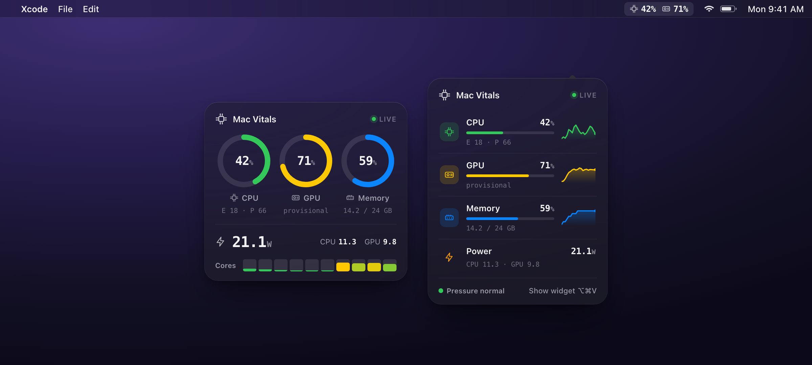
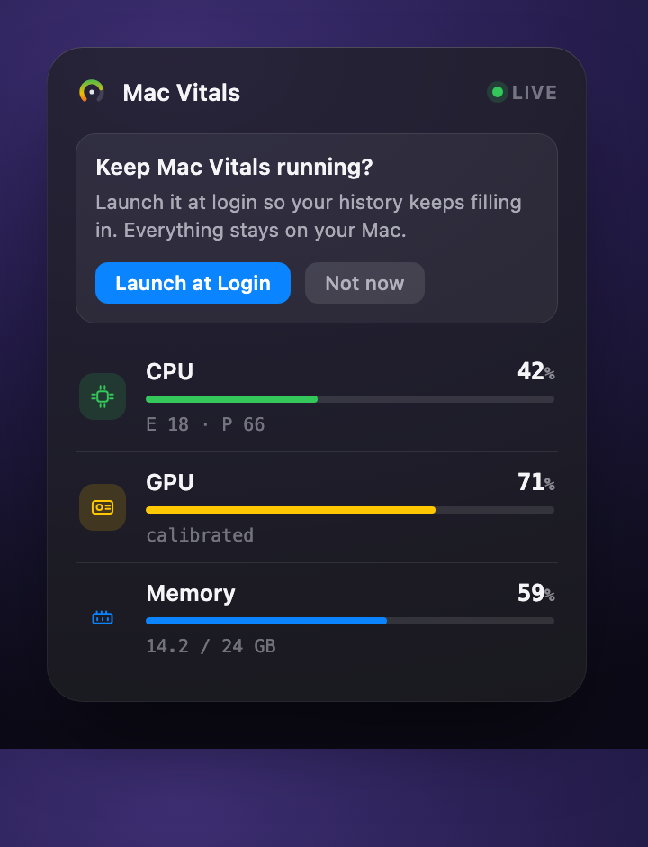
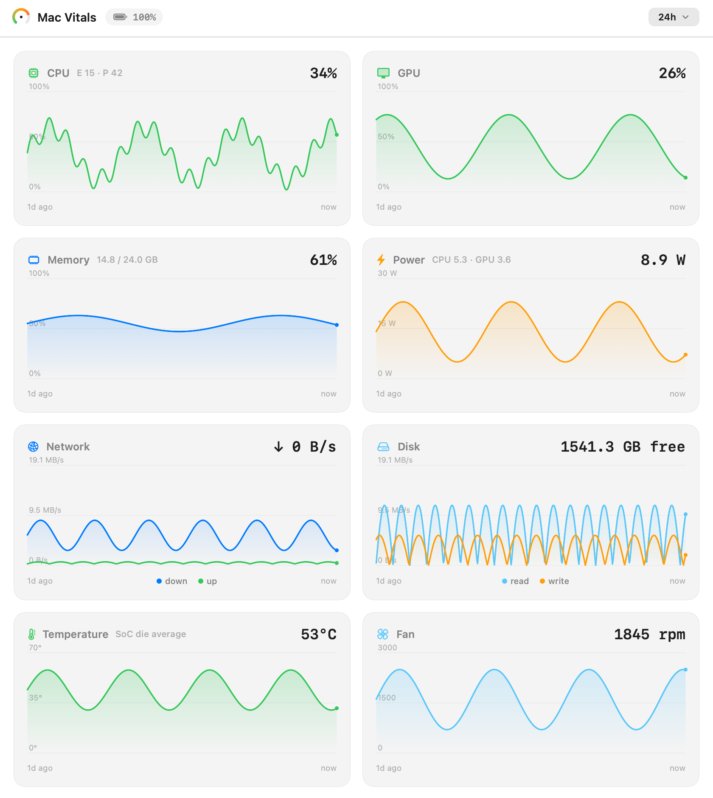
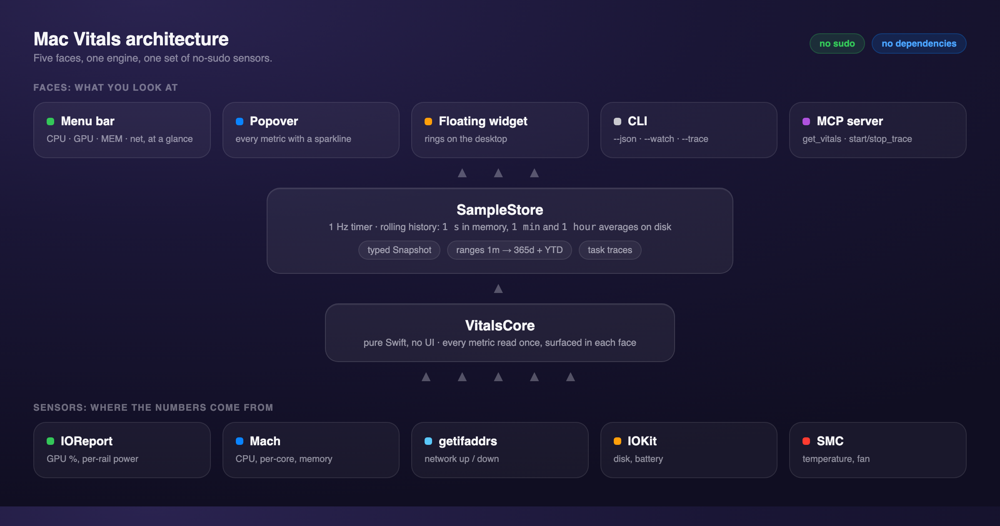

# Mac Vitals, end to end

Every Apple Silicon Mac measures itself in fine detail. The hard part is reaching that data without a password prompt or an open Activity Monitor window. This walkthrough takes you from a clean checkout to reading CPU, GPU, memory, power, and the rest at a glance, keeping a year of history, and handing the same readings to an AI agent. It is a tour of what the app does and how to drive each part.

If you just want it running, the three commands in [Install](#install) are enough. The rest explains each surface.

## Install

You need macOS 14 or later on Apple Silicon and the Xcode Command Line Tools (`xcode-select --install`).

```bash
git clone https://github.com/netsatsawat/mac-vitals.git
cd mac-vitals
./scripts/build-app.sh
open build/MacVitals.app
```

The app has no Dock icon. It lives in the menu bar. To keep it around, drag `build/MacVitals.app` into `/Applications`.

## The menu bar

The readout sits in the menu bar and refreshes once a second. In its default full form it shows CPU, GPU, and memory as percentages, then network down and up.

<div align="center">

</div>

Want it shorter? Open the popover, click the `⋯` menu, and turn off "Full menu-bar readout" to drop back to just CPU and GPU. The shortcut is ⇧⌘M.

## The popover

Click the menu-bar item for the popover: every metric in a denser list, each with a fill bar and a minute of history. CPU carries its efficiency and performance split, GPU shows whether its reading is calibrated, memory shows used against total, and power breaks into CPU and GPU rails. Network, disk, battery, and temperature follow.

The footer has three controls: **Widget** toggles the floating gadget, **Open** brings up the full window, and the `⋯` menu holds the readout toggle, Launch at Login, and Quit.

## First run: keep it running

The first time you open the popover, a one-time hint offers to keep the app running.

<div align="center">

</div>

This matters because of one honest limit: nothing is collected while the app is quit. There is no background daemon, by design. So the long history ranges only fill if the app is actually running across those days. Launch at Login is what makes that happen.

It is opt-in. The app never enables it on its own. Turn it on from the hint, or any time later from the `⋯` menu. Under the hood it registers the app as a login item through macOS's own mechanism, with no helper and no privileged step, and you can revoke it in System Settings under General, Login Items. Closing just the full window does not quit the app, so it keeps sampling in the menu bar either way.

### Menu bar, or none

You choose whether the app shows a menu-bar icon. The `⋯` menu has a **Show Menu Bar Icon** toggle, on by default. Turn it off and the app shows a short explanation, then keeps running and sampling with no icon and no interface at all. Everything still stays on your Mac, and the cost is the same one read a second.

To bring the icon back, open Mac Vitals again from Spotlight or your Applications folder. The app is still running, so opening it just makes the icon reappear, and from there you can open the window or quit. With the icon off and Launch at Login on, you get a recorder that starts with your Mac and stays completely out of the way.

## The floating widget

**Widget** in the popover footer drops a small gadget onto the desktop. It floats above other windows, you drag it anywhere, and it remembers where you left it. Three rings for CPU, GPU, and memory, the live power draw, and a per-core strip. Toggle it off from the same button.

## The full window and its history

**Open** brings up the full window: every metric as its own chart, over a range you pick from one minute of live detail up to a year, plus year-to-date.

<div align="center">

</div>

Pick the range from the control in the top right. Short ranges read per-second detail. Longer ranges read minute averages, and the longest read hour averages. When a range is longer than the app has been collecting, a small "collecting" note tells you how much it has so far.

History is kept at three resolutions, each written to its own file: per-second detail for the last hour, one-minute averages for about a week, and one-hour averages for over a year. All told a few MB. Every range survives a quit, and the long ones fill from what is already on disk rather than starting over. The design and the reasons behind it are in [history-persistence.md](history-persistence.md).

## Measuring what a task costs

The full window's toolbar has a **Trace** button. Press it, run your build or your training job, and press **Stop**. You get back what the work cost: CPU and GPU average and peak, average watts and energy in watt-hours, the bytes moved over network and disk, and the peak temperature. The same measurement is on the command line and over MCP, so an agent can wrap its own build and read the cost back.

## The command line

The same engine ships as a headless CLI, handy for scripts and for confirming a reading against the app.

```bash
swift build -c release --product vitals
.build/release/vitals            # one human-readable reading
.build/release/vitals --json     # one reading as JSON
.build/release/vitals --watch    # stream once a second
.build/release/vitals --trace 30 # measure the next 30s and print the cost
.build/release/vitals --selftest # bounded-value check, exits 0 or 1
```

## For your AI agent

Mac Vitals runs as a [Model Context Protocol](https://modelcontextprotocol.io) server over stdio, read-only. Point an MCP client at the built `vitals` binary with `--mcp`.

```bash
claude mcp add mac-vitals -- /absolute/path/to/mac-vitals/.build/release/vitals --mcp
```

It exposes `get_vitals`, `get_vitals_history`, and the `start_trace` and `stop_trace` pair. The agent can see the machine and never change it. Full setup and examples are in [MCP.md](MCP.md).

## How it works

Five front-ends read from one Swift engine, which reads every metric as a normal user, with no root and no entitlement.

<div align="center">

</div>

- CPU and memory from Mach.
- GPU and power from IOReport, loaded at runtime from `/usr/lib/libIOReport.dylib`. Those private symbols live in one file, so a future macOS change fails in one obvious place.
- Network from `getifaddrs`, disk and battery from IOKit, temperature and fan from the SMC.

GPU utilization is calibrated against `powermetrics` on the M5. It comes from the GPU's performance-state residency, where state 0 is idle, so `usage = 1 - OFF/total`. GPU power in watts is exact.

## If something looks wrong

- `.build/release/vitals --selftest` checks every reading is in a sane range and exits non-zero if not. It needs no Xcode.
- To check the Launch at Login registration from the terminal, the app answers a few diagnostic flags: `build/MacVitals.app/Contents/MacOS/MacVitals --login-status` prints whether it is registered, and `--login-register` / `--login-unregister` flip it.
- Readings look off after a macOS update? The private IOReport binding is isolated in `Sources/VitalsCore/IOReport.swift`, which is the first place to look.
